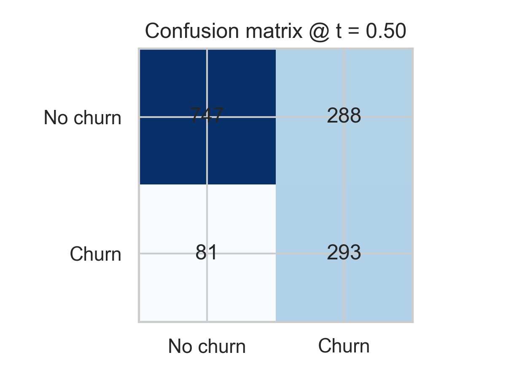
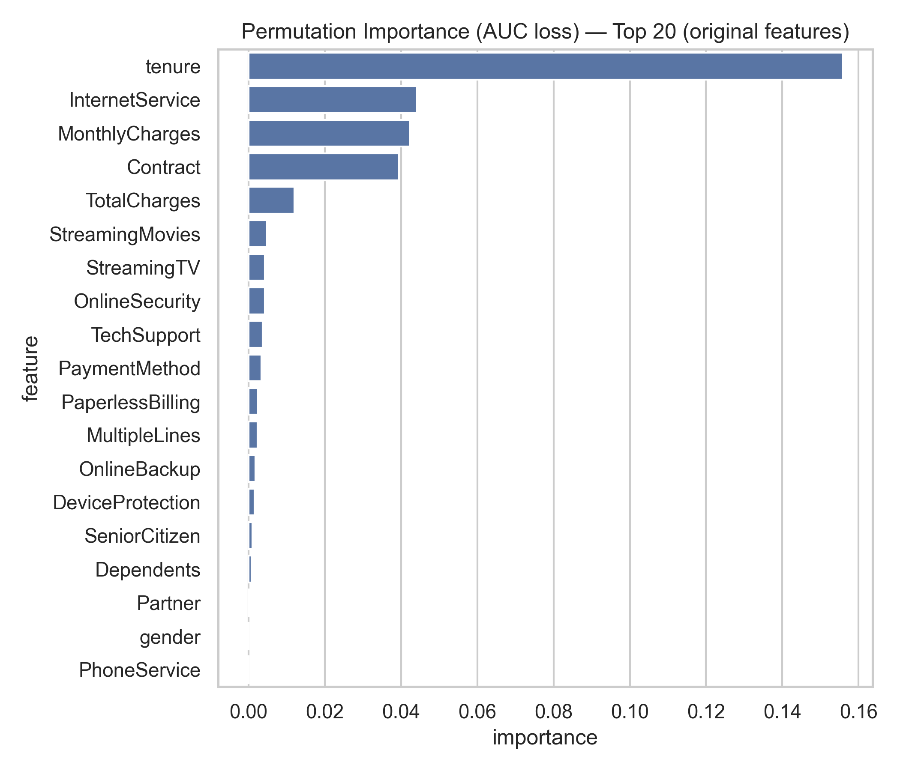

# 💡 Customer Churn Prediction

## 📘 Overview
This project builds a **customer churn prediction model** using the Telco Customer Churn dataset.
It demonstrates the full data-science workflow — from **EDA and preprocessing**, through **modeling and evaluation**, to **explainability with SHAP**.

The focus is on **balancing accuracy with interpretability**, a key aspect in regulated industries such as **banking and risk analytics**.

## 🧩 Objectives
- Predict whether a telecom customer will churn (cancel service).
- Handle **class imbalance** using `class_weight = "balanced"`.
- Compare interpretable (Logistic Regression) and non-linear (Random Forest) models.
- Explain model behavior using **SHAP values** and **permutation importance**.

## 📊 Dataset
- **Source:** [Telco Customer Churn dataset (Kaggle)](https://www.kaggle.com/datasets/blastchar/telco-customer-churn) 
- **File:** `data/Telco-Customer-Churn.csv`
- **Size:** ~7,000 rows, 21 features
- **Target:** `Churn` (binary — “Yes” or “No”)

### Key Variables
| **Type** | **Example Features**|
| ------------- | ------------- | 
| **Numerical**| `tenure`, `MonthlyCharges`, `TotalCharges` |
| **Categorical** | `Contract`, `PaymentMethod`, `InternetService`, `Partner`, `Dependents` |

## 🧠 Project Workflow
### 1️⃣ Exploratory Data Analysis & Preprocessing (`notebooks/01_eda_preprocessing.ipynb`)
- Loaded and explored raw data (`Telco-Customer-Churn.csv`).
- Handled missing or inconsistent values (`TotalCharges`).
- Converted categorical variables to consistent types.
- Encoded target variable: `Churn → 0/1`.
- Saved cleaned dataset → `data/df_preprocessed.csv`.

### 2️⃣ Modeling (`notebooks/02_modeling.ipynb`)
- Split data: 80% train / 20% test (stratified).
- Built preprocessing pipeline:
  - Standard scaling for numeric features
  - One-Hot Encoding for categoricals
- Models compared:
  - **Logistic Regression (baseline, interpretable)**
  - **Random Forest (non-linear baseline)**

#### 🔍 Results Summary
| **Model** | **ROC-AUC**| **PR-AUC** | **F1-score** | **Notes** |
| ------------- | ------------- | ------------- | ------------- | ------------- |
| Logistic Regression | **0.842**| 0.632 | 0.614 | Balanced class weight |
| Random Forest | **0.835**| 0.639 | 0.607 | Slightly higher PR-AUC |

✅ **Best model:** Random Forest
📦 Saved artifacts:
- `models/artifacts/churn_model.joblib`
- `models/artifacts/metadata.json`

### 3️⃣ Model Explainability (`notebooks/03_model_explainability.ipynb`)
Explained how the model makes predictions using **SHAP** and **Permutation Importance**.
📈 **Performance at threshold = 0.50**
- **Precision:** 0.504
- **Recall:** 0.783
- **F1:** 0.614
- **Confusion matrix:**
  ```lua
  [[747, 288],
  [ 81, 293]]
  ```
- **Test ROC-AUC:** 0.842
- **Test PR-AUC:** 0.633

#### 🔍 Key Drivers of Churn
| **Rank** | **Feature**| **Effect** | 
| ------------- | ------------- | ------------- | 
| 1 | Contract_Month-to-month | Strong positive impact on churn | 
| 2 | tenure | Longer tenure → lower churn | 
| 3 | MonthlyCharges | Higher charges → higher churn | 
| 4 | InternetService_Fiber_optic | Associated with higher churn | 
| 5 | TotalCharges | Higher total → lower churn | 

## 🧩 Visualizations
### Model Evaluation
| **Metric** | **Plot**|
| ------------- | ------------- | 
| **Confusion Matrix**|  |
| **Permutation Importance** |  |
